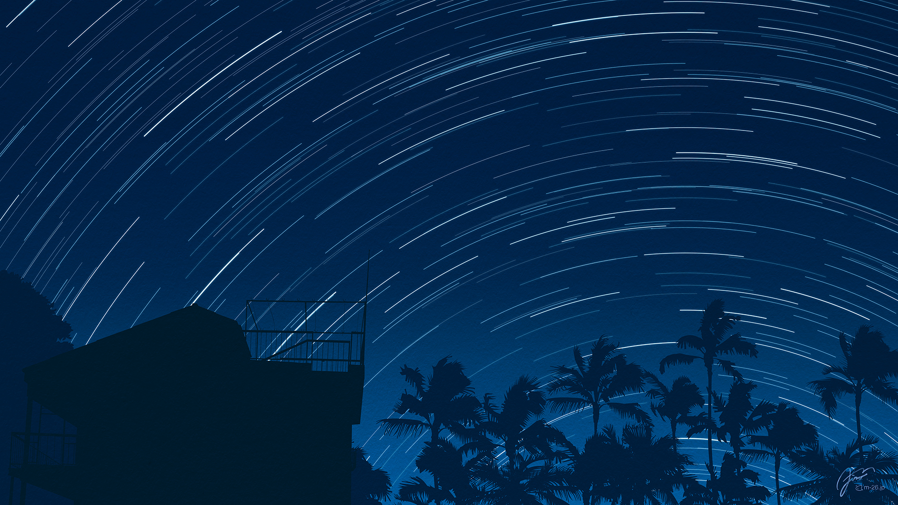
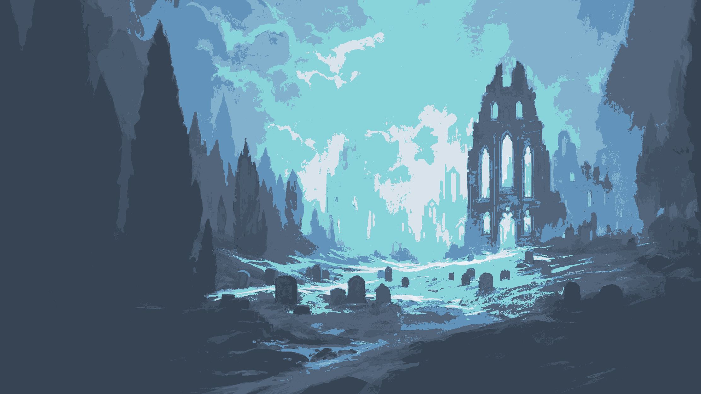
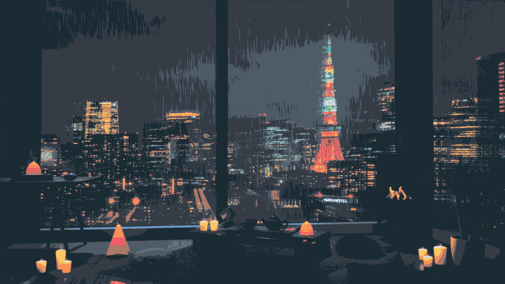

<h2 align="center">🖼️ Wallpapers Collection</h2>

  These are some of my favorite wallpapers used in my ricing setup.  
  Minimal, aesthetic, and carefully curated to match my desktop themes.

  🔗 For a larger collection of high-quality wallpapers, check out: 
  <a href="https://github.com/dharmx/walls" target="_blank">https://github.com/dharmx/walls</a>

  
  
  
  
  
  
  
  
  
  
  
  
  
  
  
  
  
  
  
  
  
  
  
  
  
  
  
  
  
  
  
  
  
  
  
  

